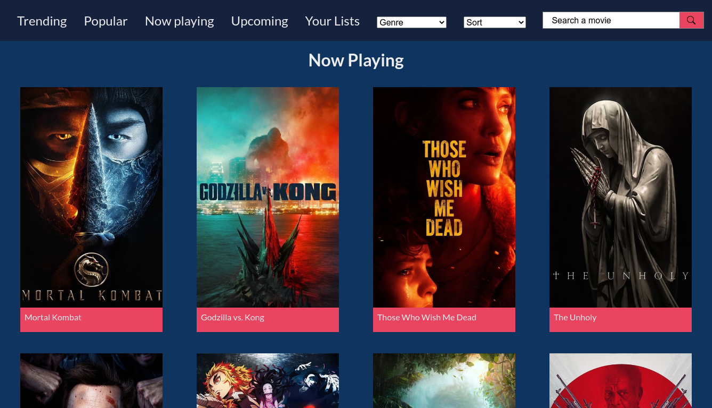

# The Catalogue, a movies search app.

This project was bootstrapped with [Create React App](https://github.com/facebook/create-react-app).

Project's data source was provided by [The Movie Database (TMDB)](https://developers.themoviedb.org/).

[View App's demo](https://the-catalogue-ce957.web.app/home)

## App features

- "Infinite Scroll".
- Fetch Movies by categories.
- Search movies.
- Sort and filter movies.
- Default and user's lists.
- Lists are saved in localStorage
- Responsive Layout, HiRes Screens include.
